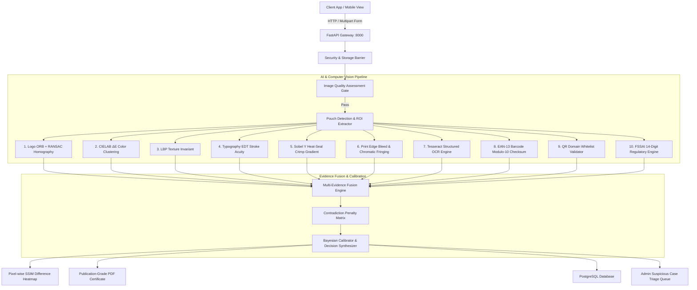

# VeriSure AI 🛡️
### AI-Assisted Product Authenticity Risk Assessment & Brand Protection Platform
*Target Domain: Flexible Dairy Packaging (Amul Milk Pouches) | Architecture: Production-Grade Design, Brand-Agnostic FMCG Framework*

[](https://github.com/pravashsingh775/VeriSure_Ai/actions/workflows/ci.yml)
[](https://www.postgresql.org/)
[](https://fastapi.tiangolo.com/)
[](https://react.dev/)
[](https://opencv.org/)
[](https://opensource.org/licenses/MIT)

---

## 🌟 Executive Summary

**VeriSure AI** is an enterprise-grade, evidence-based anti-counterfeiting and authenticity verification platform engineered specifically for flexible packaging. While traditional anti-counterfeiting solutions rely on fragile 2D QR codes (which can be easily photocopied) or opaque "black-box" neural networks, VeriSure AI evaluates packaging physical integrity across **12 independent computer vision, textual, and machine-readable evidence engines**.

The platform synthesizes these multi-modal signals into a mathematically calibrated **Authenticity Risk Score (0–100)** with pixel-wise difference heatmaps, structured reason codes, and instant tamper-evident PDF inspection certificates.

### 💡 Key Technical Highlights
- 🧠 **Zero-Cost Edge Architecture**: Runs entirely locally on CPU using OpenCV, classical CV, and Tesseract OCR without recurring external API fees.
- 🏢 **Multi-Tenant Portals**: Dedicated portals for **Consumers** (real-time scanner), **Brand Managers** (Reference Corpus V1 gallery & telemetry), and **Platform Admins** (human-in-the-loop triage & model registry).
- 🗄️ **Enterprise PostgreSQL Backend**: Dual async/sync connection pools (`asyncpg` for high concurrency + `psycopg2` for Alembic migrations), strict RBAC, and immutable cryptographic audit logging.
- 🎯 **Reference Corpus V1**: 12 official ground-truth reference standards across Amul Gold (Full Cream), Amul Taaza (Toned), and Amul Shakti (Standardised) with SHA-256 cryptographic binding.
- 🧪 **Automated test suite**: 8 test modules covering unit, integration, API, AI-decision validation, and production-readiness/red-team scenarios. The complete suite runs against PostgreSQL in CI.

---

## 🏗️ System Architecture



---

## 🔬 The 12-Engine Evidence Verification Pipeline

| # | Engine / Module | Technology / Formula | Detection Objective |
|:---:|:---|:---|:---|
| **1** | **Image Quality Gate** | $\text{Var}(\nabla^2 I)$ + HSV Glare Thresholding | Prevents blurry or poorly lit photos from generating false verdicts. |
| **2** | **Packaging Detection** | Otsu Thresholding + Convex Hull Contour Analysis | Isolates pouch boundaries and extracts perspective-corrected ROI. |
| **3** | **Logo Keypoint Matching** | ORB (Oriented FAST and Rotated BRIEF) + RANSAC Homography | Verifies brand insignia geometric consistency and identifies counterfeit copies. |
| **4** | **CIELAB Color Match** | $k$-Means Clustering ($k=4$) + CIE2000 $\Delta E$ Formula | Detects printer ink formulation discrepancies and unauthorized color shifts. |
| **5** | **Typography Acuity** | Euclidean Distance Transform (EDT) Stroke Width Variance | Identifies low-resolution typography reproduction and font mismatches. |
| **6** | **Texture Invariant** | 59-Bin Uniform Local Binary Patterns (LBP) $\chi^2$ Distance | Distinguishes original high-grade polymer substrate from cheaper substitutes. |
| **7** | **Heat-Seal Crimp Gradient** | Sobel $Y$ Derivative Frequency Across Top/Bottom Borders | Identifies illicit thermal iron reseals vs industrial pneumatic crimp patterns. |
| **8** | **Print Quality & Bleed** | High-Frequency Sobel Gradient Magnitude + Fringing Index | Detects home inkjet/laser printing artifacts on counterfeit packaging. |
| **9** | **Structured Text OCR** | Tesseract OCR + Regular Expression Information Extraction | Automatically extracts MRP, Batch Number, Manufacturing Date, and Expiry. |
| **10** | **Barcode Syntactic Check** | ZXing Computer Vision Decoder + EAN-13 Modulo-10 Checksum | Flags forged or spoofed retail barcodes. |
| **11** | **Phishing QR Whitelist** | ZXing 2D Matrix Decoder + Domain Whitelist Matching | Rejects deceptive URLs and phishing domains disguised as brand feedback portals. |
| **12** | **FSSAI Regulatory Engine** | 14-Digit Syntax Validation + Indian State Jurisdiction Mapping | Detects invalid food safety registration license numbers. |

---

## 💻 Tech Stack & Engineering Standards

* **Backend**: Python 3.10+, FastAPI (Asynchronous Web Framework), Pydantic v2.
* **ORM & Database**: SQLAlchemy 2.0, Alembic, PostgreSQL (Primary), `asyncpg` + `psycopg2`.
* **Computer Vision & AI**: OpenCV 5.x, NumPy, SciPy, scikit-image, Tesseract OCR, ZXing.
* **Frontend**: React 19, TypeScript, Vite, TailwindCSS v4, Lucide Icons, Axios.
* **Report Generation**: ReportLab (Vector Graphics & Formatted PDF Generation).
* **Testing & MLOps**: Pytest, Pytest-AsyncIO, Custom Model Registry with Robustness Benchmarks.

---

## ⚡ Quickstart & Installation

### 1. Prerequisites
- **Python**: Version 3.10 or higher
- **Node.js**: Version 18 or higher (with npm)
- **Database**: PostgreSQL (or use the built-in SQLite fallback for quick testing)

### 2. Clone and Setup
```bash
# Clone the repository
git clone https://github.com/pravashsingh775/VeriSure_Ai.git
cd VeriSure_Ai

# Install Python backend dependencies
pip install -r backend/requirements.txt

# Install frontend dependencies and build assets
cd frontend
npm install
npm run build
cd ..
```

### 3. Environment Configuration
Copy the example environment file:
```bash
cp .env.example .env
```
*(The default `.env` is pre-configured with zero-friction development settings).*

### 4. Run Development Servers (1-Click)
On Windows:
```cmd
run_dev.bat
```
Or start manually:
```bash
# Terminal 1: Backend API
python -m uvicorn backend.app.main:app --reload --port 8000

# Terminal 2: Frontend Client
cd frontend && npm run dev
```

* 🌐 **Frontend Application**: `http://localhost:5173`
* 📖 **Interactive Swagger UI**: `http://localhost:8000/docs`
* ❤️ **System Health Endpoint**: `http://localhost:8000/health`

---

## 👥 Demo Role Accounts

Test all three stakeholder personas with one click in the web app or use these credentials:

| Portal Persona | Email | Password | Assigned Permissions |
|:---|:---|:---|:---|
| **Platform Admin** | `admin@verisure.ai` | `Admin@12345` | Full system access, case triage, MLOps model registry, audit logs |
| **Brand Admin (Amul)** | `amul_admin@verisure.ai` | `Amul@12345` | Brand packaging lifecycle, Reference Corpus V1, brand telemetry |
| **Brand Reviewer** | `reviewer@verisure.ai` | `Reviewer@12345` | Suspicious case evaluation, manual annotations, feedback loop |
| **Consumer** | `consumer@verisure.ai` | `Consumer@12345` | Real-time scan upload, difference viewer, PDF report downloads |

---

## 🧪 Testing & Validation

```bash
# Run the complete test suite (requires PostgreSQL — see docker-compose.yml)
python -m pytest backend/tests/ -v
```

The suite includes **8 test modules** covering:

| Module | Coverage |
|:---|:---|
| `test_phase1_models_and_db.py` | Database models, JWT security, password hashing, storage ops |
| `test_phase2_3_4_apis.py` | Auth, RBAC, products, packaging lifecycle APIs |
| `test_phase5_to_11_pipeline.py` | End-to-end scan pipeline, quality gates, evidence absence handling |
| `test_phase15_to_18_apis.py` | Analytics, audit logs, feedback, model registry, case triage |
| `test_counterfeit_detection.py` | Synthetic tamper, logo mismatch, phishing QR, corrupted barcode |
| `test_domain_gatekeeper_and_dual_scan.py` | Brand scope gatekeeper, dual-panel verification, out-of-domain rejection |
| `test_ai_decision_validation.py` | Fusion bounds, monotonicity, abstention, fault isolation, determinism |
| `test_production_readiness_and_redteam.py` | Auth red-team, multitenant isolation, malicious upload defense, health probes |

CI executes the full suite against a PostgreSQL 16 service container on every push to `main`.

> **Note**: A small number of API integration tests are Postgres-specific (e.g. transactional isolation behavior) and are skipped/fail under the SQLite fallback. Run against PostgreSQL for the complete, authoritative result.

---

## 📊 AI Evaluation — Scientific Honesty

Full methodology and empirical results: [`docs/AI_EVALUATION_REPORT.md`](docs/AI_EVALUATION_REPORT.md) and [`docs/AI_DECISION_VALIDATION.md`](docs/AI_DECISION_VALIDATION.md).

**Critical disclosure**: **Real-world counterfeit recall is currently NOT measurable.** The repository contains **zero physical counterfeit samples collected from real retail supply chains**. No recall or accuracy claim against real counterfeits is made or should be inferred.

What *is* evaluated, with sample sizes disclosed:

* **Controlled synthetic tamper detection** (N = 4) — 100% flagged as high-risk/tampered
* **Out-of-scope negative rejection** (N = 5) — non-packaging images rejected by the domain gatekeeper
* **Factory-authentic reference matching** (N = 23) — with documented coverage limitations for single-view submissions
* **Fusion math bounds, uncertainty monotonicity, abstention behavior, and determinism** — property-based automated tests

These are engineering-validation results on small controlled cohorts, **not** statistical claims of field performance.

---

## 📁 Repository Directory Structure

```
VeriSure_Ai/
├── backend/
│   ├── app/
│   │   ├── ai/               # 12 Evidence Engines, Fusion, Orchestrator
│   │   ├── api/              # FastAPI v1 Route Handlers & RBAC Dependencies
│   │   ├── core/             # Configuration, PostgreSQL Database, Local Storage
│   │   ├── models/           # SQLAlchemy Enterprise Entity Relational Schema
│   │   ├── schemas/          # Pydantic v2 Serialization & Validation Schemas
│   │   └── services/         # Business Logic, Scan Processing, PDF Reports
│   ├── migrations/           # Alembic Database Migration Revisions
│   ├── scripts/              # Seed Scripts & Database Hygiene Automation
│   └── tests/                # 8 Pytest Modules — Integration & Regression Suites
├── frontend/
│   ├── src/
│   │   ├── components/       # UI: Scanner, DifferenceViewer, Brand & Admin Portals
│   │   ├── services/         # Axios API Client & Authentication Handlers
│   │   └── types/            # TypeScript Domain Interfaces
├── data/
│   └── storage/
│       └── references/       # Reference Corpus V1 Official Amul Standard Assets
├── docs/                     # System Architecture, ER Diagrams, & Forensic Audits
├── run_dev.bat               # 1-Click Multi-Process Development Launcher
├── run_prod.py               # Unified Single-Process Production Server
└── README.md                 # Project Showcase & Documentation
```

---

## ⚖️ Academic & Legal Disclaimer

*VeriSure AI is an artificial-intelligence-assisted packaging conformity assessment tool designed for anti-counterfeiting research and brand protection. A photograph evaluates exterior packaging, print, and seal integrity; it cannot analyze or guarantee the chemical, nutritional, or microbiological contents inside a sealed container.*

---

## ⚠️ Known Limitations

Framed professionally — these are legitimate research/data constraints, not defects:

1. **No real-world counterfeit ground truth**: Zero physically seized counterfeit samples exist in the corpus. Real-world counterfeit recall is therefore unmeasurable; only synthetic-tamper and open-set-negative performance are characterized.
2. **Product scope**: Verification is trained on the Amul (GCMMF) flexible dairy packaging reference corpus (Gold, Taaza, Shakti). Other products/brands are out of scope and rejected by the domain gatekeeper by design.
3. **Reference-corpus dependence**: Accuracy is bounded by the quality, coverage, and currency of ground-truth reference images. Packaging redesigns require corpus updates (V1 → V2 already demonstrates this lifecycle).
4. **Synthetic tamper evaluation**: Tamper cohorts are artificially generated; physical tampering exhibit different artifact distributions.
5. **Single-view coverage penalty**: Single-panel submissions legitimately receive reduced evidence coverage and may trigger abstention — this is intended conservative behavior, not a bug.
6. **Photographic constraints**: Exterior packaging assessment cannot verify product contents, fill weight, or interior quality.

---

<p align="center">
  <b>Engineered with precision for modern FMCG brand protection.</b><br>
  Developed by <b>Pravash Singh</b>
</p>


