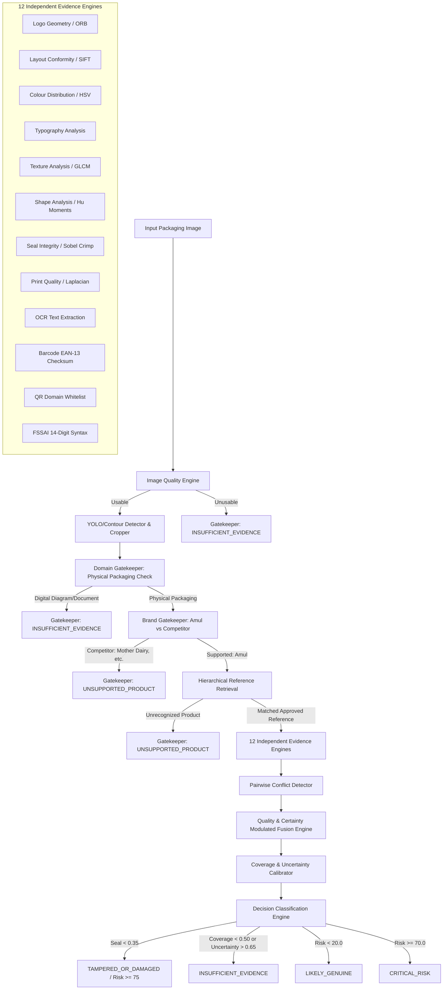

# VeriSure AI — AI Decision Correctness & Red-Team Validation Methodology

## 1. System Architecture & Decision Pipeline

VeriSure AI implements a multi-stage, defense-in-depth verification pipeline designed to detect counterfeit, tampered, and out-of-scope dairy packaging without generating false-positive authentic classifications.

---

## 2. Mathematical Fusion Specification

### 2.1 Effective Weight Modulations
For each of the $M$ available evidence objects $e_i \in \mathcal{E}$:
$$w_i = W_{\text{base}}(e_i.\text{type}) \times c_i \times q_i$$
where:
- $W_{\text{base}}$ is the calibrated base weight assigned to evidence type $i$
- $c_i \in [0.01, 1.0]$ is the engine-reported certainty
- $q_i \in [0.01, 1.0]$ is the localized crop image quality

### 2.2 Weighted Normalized Raw Score
$$S_{\text{raw}} = \frac{\sum_{i=1}^M w_i \cdot s_i}{\sum_{i=1}^M w_i}$$
If $\sum w_i = 0$ or no evidence is available, $S_{\text{raw}}$ falls back safely to $0.50$.

### 2.3 Contradiction Penalty Calculation
$$\Delta_{\text{conflict}} = \min\left(0.45, \sum_{k} \delta_k\right)$$
Pairwise contradiction rules:
1. **Branding Authentic + Barcode Mismatch**: $s_{\text{logo}} > 0.80 \land s_{\text{barcode}} < 0.30 \implies \delta_1 = 0.20$
2. **Branding Authentic + Seal Compromised**: $s_{\text{seal}} < 0.35 \land s_{\text{logo}} > 0.75 \implies \delta_2 = 0.25$
3. **Packaging Text Valid + QR Phishing Domain**: $s_{\text{ocr}} > 0.80 \land s_{\text{qr}} < 0.40 \implies \delta_3 = 0.15$

### 2.4 Fused Authenticity Score
$$S_{\text{fused}} = \text{clip}\left(S_{\text{raw}} \times (1.0 - \Delta_{\text{conflict}}), 0.05, 0.98\right)$$

### 2.5 Inverted Risk Score
$$\text{Risk Score} = \text{clip}\left(\text{round}\left((1.0 - S_{\text{fused}}) \times 100.0, 1\right), 0.0, 100.0\right)$$

### 2.6 Evidence Coverage
$$\text{Evidence Coverage} = \frac{\text{Count}(\text{Available Engines})}{12}$$

### 2.7 Assessment Confidence & Uncertainty Calibration
$$\text{Composite Confidence} = \text{clip}\left(0.40 \cdot Q_{\text{overall}} + 0.60 \cdot \text{mean}(Q_{\text{evidence}}), 0.05, 0.99\right)$$
$$\text{Uncertainty} = \text{clip}\left(1.0 - (\text{Coverage} \times \text{Confidence} \times (1.0 - \Delta_{\text{conflict}})), 0.05, 0.95\right)$$

---

## 3. Decision Gatekeeper Taxonomy

| Gate | Condition | Resulting Decision State | Risk Score | Consumer Guidance |
| :--- | :--- | :--- | :---: | :--- |
| **Gate 0: Domain** | Input is non-packaging (diagram, schematic, invoice) | `INSUFFICIENT_EVIDENCE` | 0.0 | Upload a clear photo of physical packaging |
| **Gate 1: Brand** | Detected brand is non-Amul (e.g. Mother Dairy, Nandini) | `UNSUPPORTED_PRODUCT` | 0.0 | System supports Amul dairy pouches only |
| **Gate 1.5: Duplicate** | Both submitted views are identical or two front panels | `INSUFFICIENT_EVIDENCE` | 50.0 | Upload one front panel and one back panel |
| **Gate 2: Quality** | Blurry, severe glare, or underexposed | `INSUFFICIENT_EVIDENCE` | 50.0 | Recapture under clearer, indirect lighting |
| **Gate 3: Identity** | Unrecognized packaging variant | `UNSUPPORTED_PRODUCT` | 0.0 | Unregistered variant in factory corpus |
| **Gate 4: Seal Tamper** | Heat-seal score $s_{\text{seal}} < 0.35$ | `TAMPERED_OR_DAMAGED` | $\ge 75.0$ | **DO NOT CONSUME.** Puncture or reseal anomaly |
| **Gate 5: Abstention** | Coverage $< 0.50$ OR Uncertainty $> 0.65$ | `INSUFFICIENT_EVIDENCE` | 50.0 | Evidence insufficient for reliable determination |
| **Gate 6: Standard Risk** | Risk $< 20.0 \land \Delta_{\text{conflict}} = 0$ | `LIKELY_GENUINE` | Calculated | Packaging congruent with official standards |
| **Gate 6: High Risk** | Risk $\ge 45.0$ | `HIGH_RISK` | Calculated | Significant packaging deviations detected |
| **Gate 6: Critical Risk** | Risk $\ge 70.0$ or (Conflicts $\land$ Risk $\ge 50.0$) | `CRITICAL_RISK` | Calculated | High counterfeit probability. Do not consume |

---

## 4. Fault Isolation & Defense-in-Depth

Individual evidence analyzers are executed behind a static fault barrier `_safe_analyze`. If any engine throws an unhandled exception (e.g. OpenCV memory reallocation, corrupt EXIF raster, easyocr timeout):
1. The exception is intercepted and logged with full traceback.
2. An `EvidenceObject` is returned with `availability=False, score=None, confidence=0.10`.
3. Total evidence coverage decreases proportionally.
4. If multiple engines fail, coverage drops below $0.50$, triggering explicit abstention (`INSUFFICIENT_EVIDENCE`).
5. **Zero 500 crashes, zero fabricated evidence scores, and zero false authentic confidence.**

