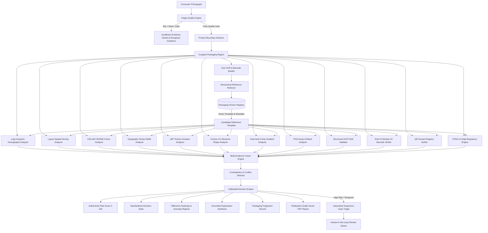
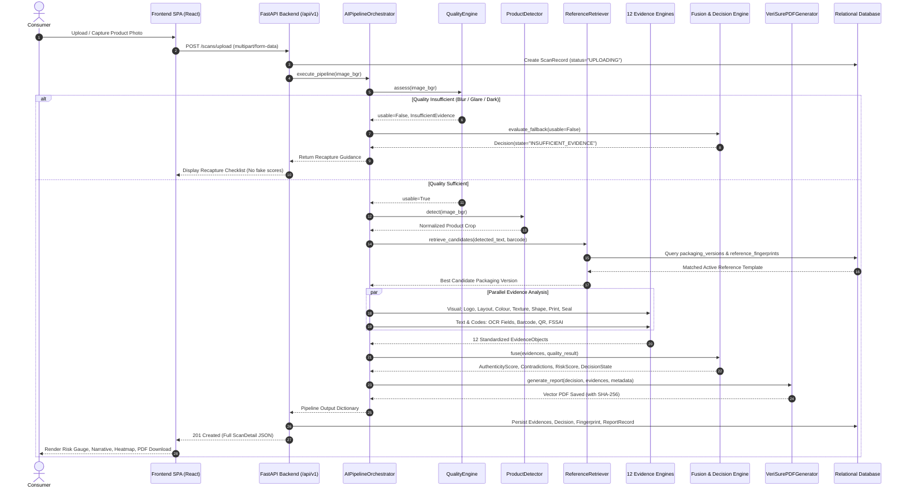
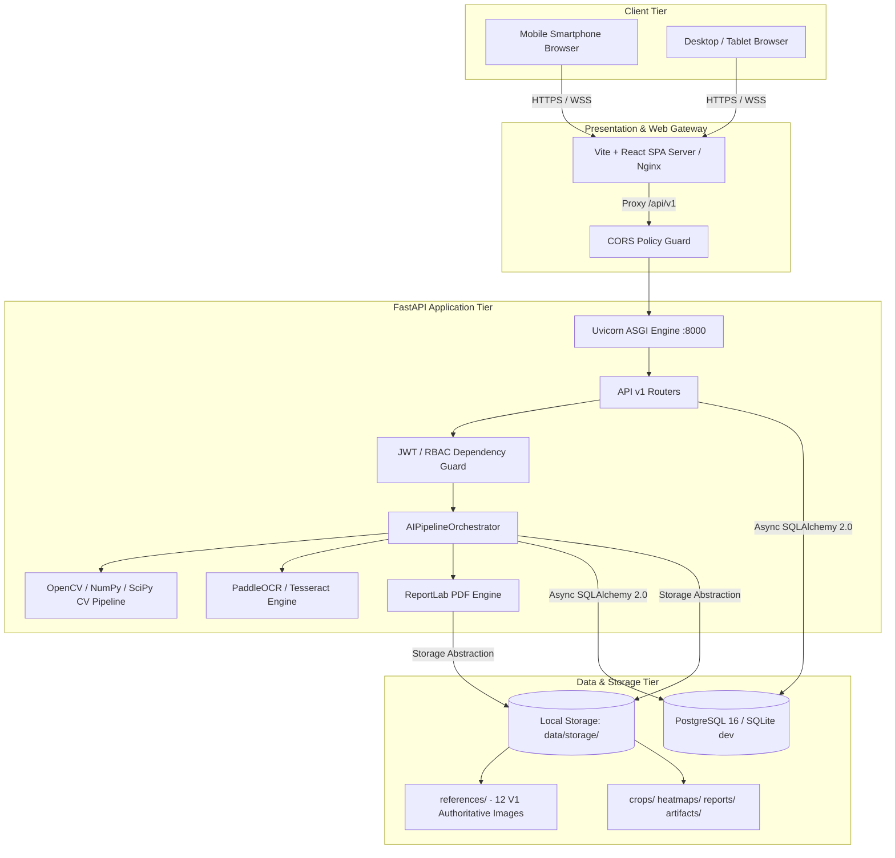
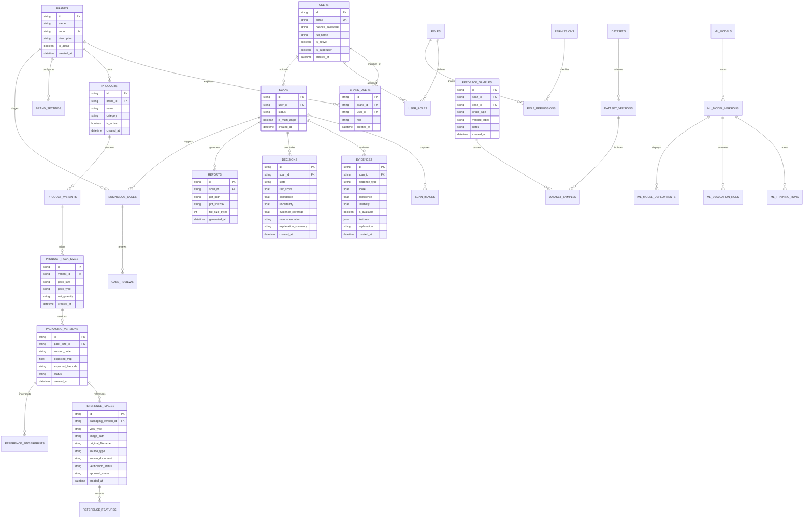

# VeriSure AI — System Architecture & Technical Specification

> **AI-Based Product Authenticity Risk Assessment & Brand Protection Platform**  
> *Initial Domain: Amul Dairy & Milk Packaging | Architecture: Brand-Agnostic FMCG*

---

## 1. Executive Summary & Philosophy

Counterfeit and tampered FMCG goods represent a severe public health hazard, economic drain, and reputational risk to trusted cooperatives such as Amul. Conventional anti-counterfeit systems suffer from two fatal design flaws:
1. **The Monolithic Black-Box Fallacy**: Attempting to train a single deep neural network on packaging photos produces uninterpretable predictions, hallucinates high confidence on novel counterfeits, and fails to identify physical tampering (e.g. syringe puncture or ironed reseals).
2. **False Claims of Contents Certification**: A 2D photograph of a milk pouch **cannot** verify the biochemical purity of liquid milk inside. Claiming 100% legal authenticity certification from a camera scan is scientifically dishonest.

**VeriSure AI** resolves both flaws by introducing an **Evidence-Verification Architecture**:
- It evaluates packaging across **12 independent, replaceable visual, textual, and machine-readable engines**.
- It treats each engine's output as an **evidence object** with explicit certainty, coverage, and quality scores.
- It detects **cross-engine contradictions** (e.g., logo matches authentic artwork, but barcode is inconsistent or heat-seal crimp indicates manual ironed tampering).
- It generates **calibrated authenticity risk scores (0–100)** with grounded natural language explanations and pixel-wise difference heatmaps.

---

## 2. End-to-End System Pipeline

---

## 3. The 12 Independent Evidence Engines

### 3.1. Image Quality Engine (`backend/app/ai/quality/engine.py`)
Assesses photographic adequacy before verification:
- **Blur Score**: Variance of Laplacian ($\sigma^2_{\Delta}$). Threshold: $\ge 80.0$.
- **Brightness Score**: Deviations from mid-tone intensity ($\mu = 135$). Detects underexposure ($\mu < 45$) or blowout ($\mu > 235$).
- **Contrast Score**: Standard deviation of pixel intensities ($\sigma_{\text{gray}}$).
- **Specular Glare Ratio**: Identifies desaturated clipped pixels in HSV space ($V > 250, S < 15$). More than 22% flags `HARSH_PACKAGING_GLARE`.
- **Framing / Occlusion**: Border edge activity via Canny filtering to detect severe cutoff.

### 3.2. Packaging Boundary Detector (`backend/app/ai/detection/engine.py`)
- Canny edge detection followed by morphological closing ($15 \times 15$ kernel).
- Finds external contours and filters by packaging area ratio ($> 15\%$) and aspect ratio ($0.45 \le \text{AR} \le 2.2$).
- Crops packaging into normalized ROI.

### 3.3. Logo Keypoint & Homography Analyzer (`backend/app/ai/vision/logo.py`)
- ORB keypoint detector (500 features).
- Lowe's ratio test ($0.75$) with k-Nearest Neighbors (k-NN).
- RANSAC homography estimation; computes inlier consensus ratio.
- Normalized Cross-Correlation (NCC) and HSV color correlation on warped logo patch.

### 3.4. Layout Spatial Density Profiler (`backend/app/ai/vision/layout.py`)
- 4-band spatial density profiling across vertical and horizontal axes.
- Computes relative element displacement and center-of-mass shift.

### 3.5. CIELAB Colour Analyzer (`backend/app/ai/vision/colour.py`)
- Converts BGR image to device-independent CIELAB color space.
- Performs k-means clustering ($k=4$) to extract dominant packaging palette.
- Computes Euclidean and CIE2000 $\Delta E$ color distance against genuine brand palette.

### 3.6. Typography & Stroke Width Analyzer (`backend/app/ai/vision/typography.py`)
- Otsu adaptive binarization to segment print characters.
- Euclidean Distance Transform (EDT) computes continuous stroke width distribution.
- Coefficient of variation ($\text{CV} = \sigma_{\text{stroke}} / \mu_{\text{stroke}}$) detects uneven ink bleed or blurry counterfeit typesetting.

### 3.7. Texture Invariant Analyzer (`backend/app/ai/vision/texture.py`)
- Uniform Local Binary Patterns ($P=8, R=1$).
- Calculates 59-bin normalized LBP histogram.
- Chi-square distance ($\chi^2$) measures micro-texture deviation of packaging substrate.

### 3.8. Packaging Shape & Hu Moments Analyzer (`backend/app/ai/vision/shape.py`)
- Extracts external contour polygon.
- Computes 7 log-transformed Hu Moment invariants for scale, translation, and rotation invariance.

### 3.9. Heat-Seal Crimp Gradient Analyzer (`backend/app/ai/vision/seal.py`)
- Isolates top (0–8%) and bottom (92–100%) sealing zones.
- Applies Sobel Y derivative operator to detect periodic crimping ridges produced by industrial form-fill-seal (FFS) machinery.
- Anomaly detection: Flat, smooth, or melted ridges indicate manual household iron reseals or counterfeit packaging.

### 3.10. Print Acuity & Chromatic Bleed Analyzer (`backend/app/ai/vision/print.py`)
- High-frequency edge gradient magnitude measures industrial flexographic / rotogravure print sharpness.
- Channel cross-correlation between Red and Blue channels measures ink registration fringing.

### 3.11. Code & Structured OCR Engines (`backend/app/ai/ocr/engine.py`, `codes/`)
- **OCR Engine**: Extracts raw text, parses MRP, FSSAI, batch number, manufacturing & expiry dates using contextual regular expressions.
- **Barcode Analyzer**: ZXing-CPP decoder, validates EAN-13 Modulo-10 checksum digit, and checks registered brand catalog barcode.
- **QR Analyzer**: Decodes 2D barcode payload and validates target domain against registered brand URL whitelist.
- **Certification Analyzer**: Validates 14-digit Indian FSSAI license format, extracts registration jurisdiction (e.g. Code 24 Gujarat), and verifies format validity.

---

## 4. Multi-Evidence Fusion & Contradiction Detection

VeriSure AI strictly avoids simple arithmetic averaging. Instead, evidence is synthesized through calibrated weighted fusion:

$$w_i = W_{\text{base}}(e_i.\text{type}) \times e_i.\text{confidence} \times e_i.\text{quality}$$

### Contradiction Penalty Matrix
When independent engines return contradictory high-confidence signals:
1. **Artwork Matches vs Barcode Mismatch**: Logo $> 0.80$ but Barcode $< 0.30$ $\implies$ Penalty $\Delta_1 = 0.20$ ("Possible packaging replica or outdated version").
2. **Artwork Matches vs Seal Compromised**: Logo $> 0.75$ but Seal $< 0.35$ $\implies$ Penalty $\Delta_2 = 0.25$ ("Physical tampering or manual reseal").
3. **OCR Text Valid vs QR Phishing**: OCR $> 0.80$ but QR domain unverified $\implies$ Penalty $\Delta_3 = 0.15$.

$$\Delta_{\text{conflict}} = \min(0.45, \sum \Delta_k)$$

### Fused Authenticity & Risk Score
$$S_{\text{fused}} = \left(\frac{\sum w_i \cdot s_i}{\sum w_i}\right) \times (1.0 - \Delta_{\text{conflict}})$$

$$\text{Risk Score} = \text{round}\Big((1.0 - S_{\text{fused}}) \times 100.0, 1\Big)$$

$$\text{Uncertainty} = 1.0 - \Big(\text{Coverage} \times \text{Mean Quality} \times (1.0 - \Delta_{\text{conflict}})\Big)$$

---

## 5. Decision State Machine

| State | Risk Score | Coverage | Conditions | Advisory Action |
|---|---|---|---|---|
| `INSUFFICIENT_EVIDENCE` | 50.0 | — | Image quality gate failed (blur, glare, dark) | Recapture photograph following guided checklist |
| `UNSUPPORTED_PRODUCT` | 50.0 | — | Packaging not found in active catalog | Product not cataloged in reference database |
| `TAMPERED_OR_DAMAGED` | $\ge 75.0$ | Any | Seal crimp score $< 0.35$ | **DO NOT CONSUME.** Package integrity compromised |
| `CRITICAL_RISK` | $\ge 70.0$ | Any | Multi-marker deviation or severe contradiction | High counterfeit probability. Report to brand |
| `HIGH_RISK` | $45.0 - 69.9$ | Any | Significant deviations from factory standard | Exercise caution. Verify retail purchase receipt |
| `MEDIUM_RISK` | $20.0 - 44.9$ | Any | Noticeable variations; potential batch tolerance | Verify retail source |
| `LOW_RISK` | $10.0 - 19.9$ | $\ge 0.65$ | High conformity with minor tolerance | Low counterfeit risk based on available packaging evidence |
| `LIKELY_GENUINE` | $< 10.0$ | $\ge 0.75$ | High confidence, all markers congruent | Packaging aligns closely with factory reference (cannot verify internal contents) |

---

## 6. Difference Heatmaps & Report Generation

- **SSIM Difference Heatmap**: Normalizes scan crop to reference dimensions, computes structural difference map, applies Gaussian smoothing to suppress sensor noise, and blends a **JET pseudo-color overlay** (Blue = Identical match, Red = Structural difference).
- **Salient Anomaly Detection**: Extracts bounding boxes of difference regions exceeding $2\%$ of package area and computes regional difference magnitudes.
- **Publication-Grade PDF**: ReportLab generates vector PDF reports containing scan metadata, executive verdict, evidence breakdown table, consumer advisory, and mandatory academic disclaimers.

---

## 7. End-to-End Verification Sequence Diagram

---

## 8. Physical Deployment Architecture

---

## 9. Complete Relational Database ER Diagram

